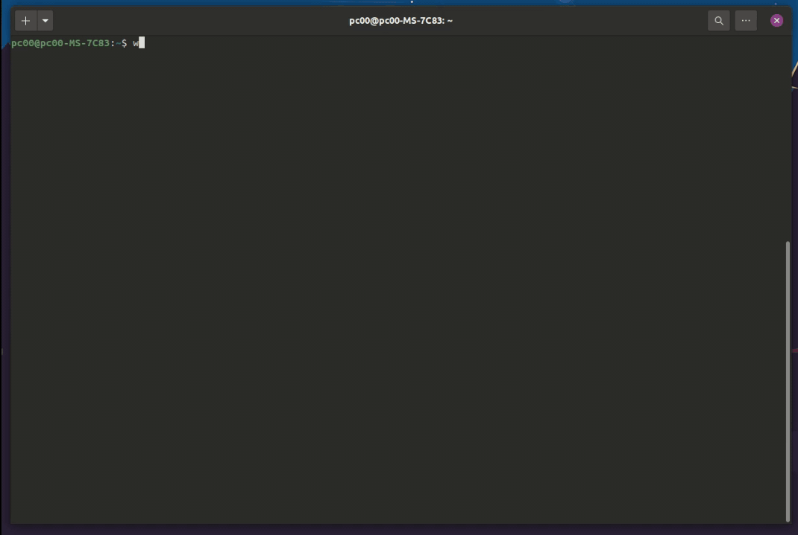

# whatsapp-fzf
Send and receive Whatsapp messages from terminal. Uses [fzf-menu](https://github.com/junegunn/fzf) as an interface for the user.

Currently tested only on Linux.

**NOTE** : Internally [whatsapp-web.js](https://www.npmjs.com/package/whatsapp-web.js) is being used to send and receive messages. Though it has been safe as per my testing, I cannot promise that your number will not be blocked by Whatsapp. Also, this project is not affiliated, associated, authorized or endorsed with [Whatsapp](https://whatsapp.com) or any of its subsidiaries or affiliates in any way.

## Demo:

## Features:
- Send and receive messages from all your contacts
- View recent messages from contacts
- Receive media files.
- View about and profile picture of contacts

## Installation:

### Step 1 (Installing Dependencies):
At first, you need to install [fzf](https://github.com/junegunn/fzf) (for the interface) and [mdcat](https://github.com/lunaryorn/mdcat) (for previewing messages). The installation instructions can be found at their respective Github repositories:

[https://github.com/junegunn/fzf](https://github.com/junegunn/fzf)

[https://github.com/lunaryorn/mdcat](https://github.com/lunaryorn/mdcat)

### Step 2:

To install whatsapp-fzf, enter the command:

`sudo npm install -g whatsapp-fzf`

For some distros, you might encounter an error due to permissions. If so try:

`sudo npm install -g --unsafe-perm=true --allow-root whatsapp-fzf`

After installation, you need to enter the command:

`whatsapp-fzf-init`

## Usage:
In terminal, just enter `whatsapp-fzf` and scan the QR Code to start chatting.

### Configuration:
Get your global node-modules folder path by entering the command:

`npm root -g`

*Cd* to that directory. The config file is located at *whatsapp-fzf/config.js* from that directory.

You can change the number of convesations fetched on startup, the number of messages per conversation, preferred text editor, whether to download media files and some other options.

